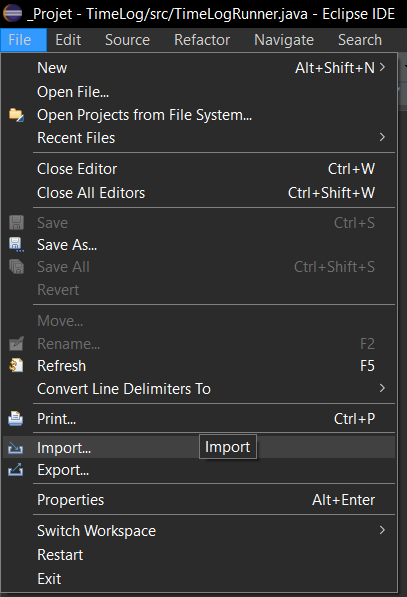
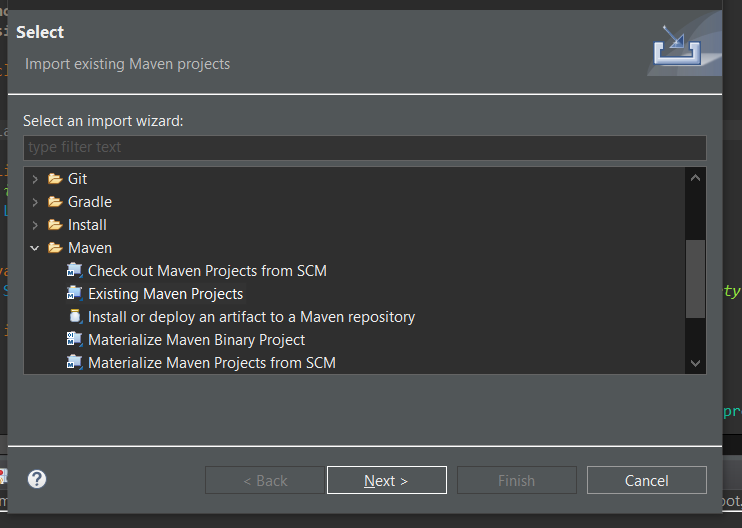

# inf1163-TimeLog
Ce projet Java a été créé à l'aide du IDE Eclipse. Il utilise Apache Maven pour télécharger automatiquement des libraires externe. Maven est un outil de gestion et d'automatisation de production des projets logiciels Java.

## Librairies externes
Le projet TimeLog utilise les librairie externes suivantes (téléchargées et installées à l'aide de Maven):
- **json-simple**: Utilisé pour lire et écrire les fichiers `.json` qui servent de couche de persistence.
- **commons-io**: Utilisé pour copié les certains fichiers lors de l'initialisation du projet.

## Procédure d'importation du projet dans Eclipse
1. Faire un clone du "repository" GitHub
1. Importer le dossier `Code_Source` en tant que `Existing Maven Project`
    
    

## Initialisation des données
Lors de la toute première exécution du programme (Debug ou JAR), tous les fichiers `.json` sont copiées dans un dossier `.timeLog` créé dans le dossier personel du compte utilisateur.

Par exemple, sur Windows, le dossier est créé à l'endroit suivant:
`C:\Users\<currentUser>\.timeLog`.

Cette opération est nécessaire puisque les fichiers `.json` servent de couche de persistence des données et les fichiers inclus dans un JAR sont offerts en lecture seulement. Les fichiers se trouvant dans le dossier `C:\Users\<currentUser>\.timeLog` sont offerts en lecture et écriture.

### Réinitialisation des données
Si lors du développement, il devient nécessaire de réinitialiser le contenu des fichiers `.json` copiés. Simplement supprimer le dossier `C:\Users\<currentUser>\.timeLog` et relancer l'exécution du programme.